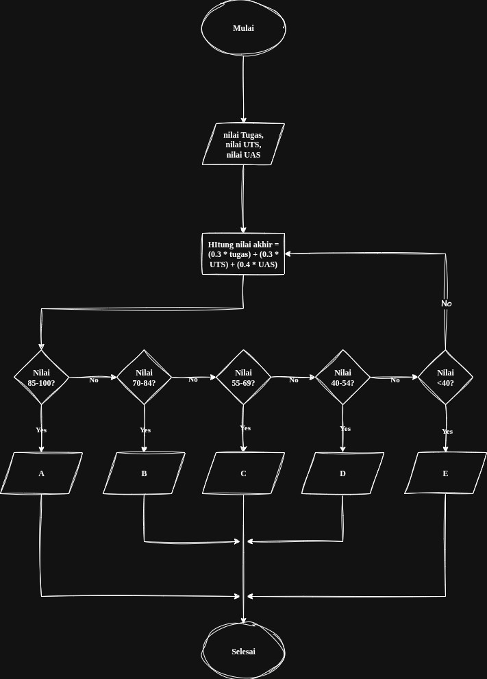

# Tugas Dasar Pemrograman
>> Program sederhana menghitung nilai akhir dan menentukan grade

## Algoritma 
1. Mulai
2. Input nilai tugas, uts, nilai uas
3. Hitung nilai akhir = (0.3 * tugas) + (0.3 * UTS) + (0.4 * UAS)
4. Tentukan grade berdasarkan nilai akhir
	85-100 = A
	70-84  = B
	55-69  = C
	40-54  = D
	<40    = E
5. Output A, B, C, D, E
6. Selesai

## Pseudocode
START

INPUT tugas
INPUT uts
INPUT uas

nilaiAkhir = (tugas * 0.3) + (uts * 0.3) + (0.4 * uas)

IF nilaiAkhir >= 85 AND nilaiAkhir <= 100
	THEN grade = "A"
ELSE IF nilaiAkhir >= 70 AND nilaiAkhir <= 84
	THEN grade = "B"
ELSE IF nilaiAkhir >= 55 AND nilaiAkhir <= 69
	THEN grade = "C"
ELSE IF nilaiAkhir >= 40 AND nilaiAkhir <= 54
	THEN grade = "D"
ELSE IF nilaiAkhir < 40
	THEN grade = "E"
ELSE
	grade = "Invalid"
END IF

OUTPUT "Nilai Akhir:", nilaiAkhir
OUTPUT "Grade:", grade

STOP

# Flowchart
